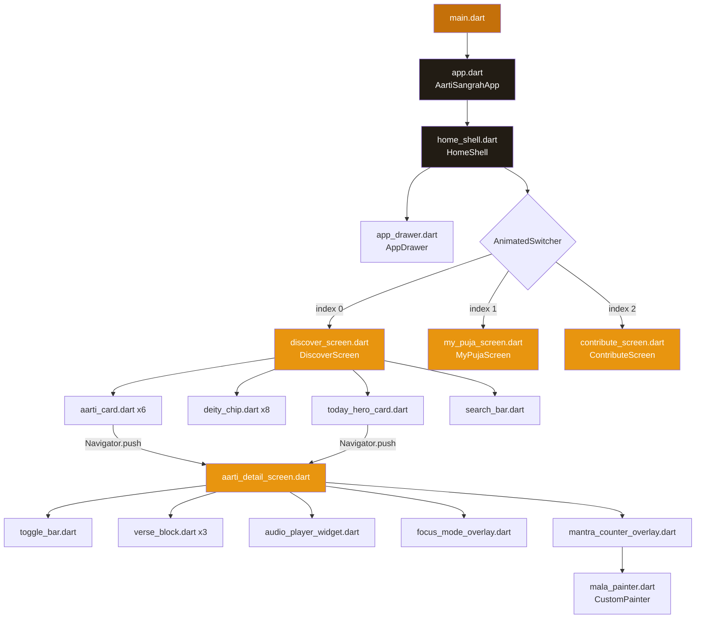
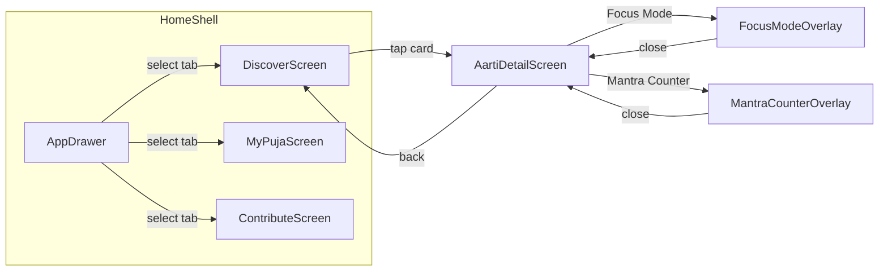
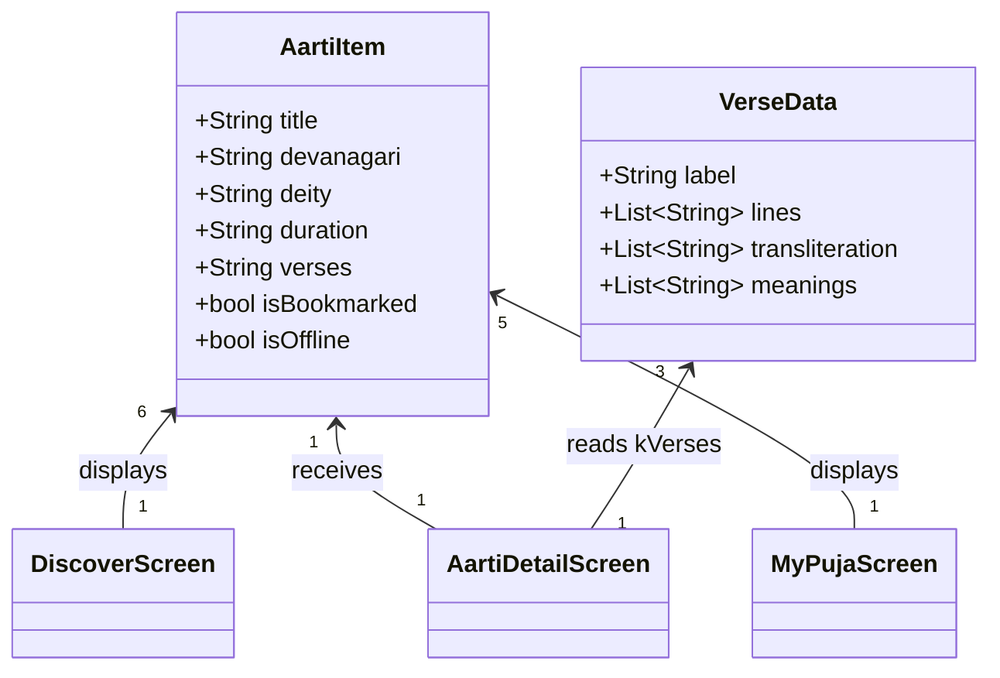
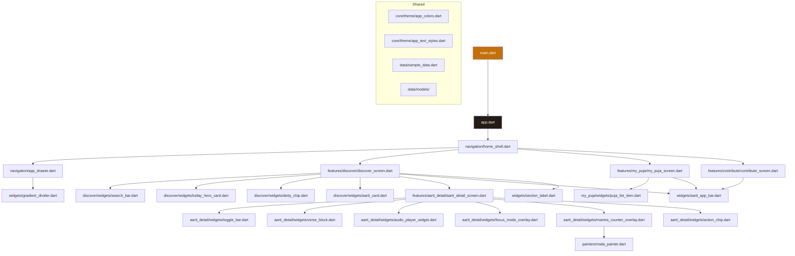

# Aarti Sangrah — Technical Documentation

**Version:** 1.0.0+1  
**Date:** March 20, 2026  
**Platform:** Flutter (Cross-platform: Android, iOS, Web, Windows, macOS, Linux)  
**Language:** Dart (SDK ^3.9.0)

---

## 1. System Overview

**Aarti Sangrah** is a Hindu prayer book (Aarti collection) mobile and multi-platform application built with **Flutter**. It provides users with a curated catalog of Indian devotional hymns (Aartis) organised by deity. The application allows users to:

- **Discover** Aartis with a rich browsable UI, filterable by deity.
- **Read** lyrics in Devanagari script, with optional transliteration (Roman) and Hindi-to-English meaning views.
- **Simulate audio playback** with a sticky audio player, play/pause, scrub, skip, and repeat controls.
- **Focus Mode** (Sadhana Mode) — a distraction-free, dark-themed overlay for reading/chanting.
- **Mantra Counter** — a 108-bead Mala counter with haptic feedback for Japa meditation.
- **My Daily Puja** — a personalized, ordered puja session playlist with drag-handle reordering UI and session controls.
- **Contribute** — a form to submit new Aartis privately or for global community review.

The app currently runs entirely on **static/in-memory data** with no backend, database, or external API integration.

---

## 2. Architecture Overview

### 2.1 Architecture Style

| Characteristic | Value |
|---|---|
| **Style** | Feature-based modular structure across 22 files |
| **Pattern** | Widget-tree composition with imperative `StatefulWidget` state management |
| **State Management** | Local `setState()` within individual `StatefulWidget` classes — no external state management library (Provider, Riverpod, Bloc, etc.) |
| **Navigation** | Imperative `Navigator.push()` / `Navigator.pop()` |
| **Data Layer** | Hard-coded `const` Dart lists (`kAartis`, `kVerses`, `kDeities`) in `lib/data/sample_data.dart` — no persistence, no API |

### 2.2 Key Architectural Components

| Layer | Components | Location |
|---|---|---|
| **App Entry** | `main()` | `lib/main.dart` |
| **App Config** | `AartiSangrahApp` (MaterialApp + theme) | `lib/app.dart` |
| **Design Tokens** | `AppColors`, `AppTextStyles` | `lib/core/theme/` |
| **Data Models** | `AartiItem`, `VerseData` | `lib/data/models/` |
| **Sample Data** | `kAartis`, `kVerses`, `kDeities` | `lib/data/sample_data.dart` |
| **Shell / Navigation** | `HomeShell`, `AppDrawer`, `NavItem` | `lib/navigation/` |
| **Discover Feature** | `DiscoverScreen`, `SearchBar`, `TodayHeroCard`, `DeityChip`, `AartiCard` | `lib/features/discover/` |
| **Aarti Detail Feature** | `AartiDetailScreen`, `ToggleBar`, `VerseBlock`, `AudioPlayerWidget`, `FocusModeOverlay`, `MantraCounterOverlay`, `ActionChip` | `lib/features/aarti_detail/` |
| **My Puja Feature** | `MyPujaScreen`, `PujaListItem` | `lib/features/my_puja/` |
| **Contribute Feature** | `ContributeScreen` | `lib/features/contribute/` |
| **Shared Widgets** | `AartiAppBar`, `HamburgerButton`, `SectionLabel`, `GradientDivider` | `lib/widgets/` |
| **Custom Painting** | `MalaPainter` — `CustomPainter` for the Mala bead ring | `lib/painters/` |

---

## 3. Project Structure

```
lib/
├── main.dart                                    # App entry point (14 lines)
├── app.dart                                     # AartiSangrahApp MaterialApp + theme
├── core/
│   └── theme/
│       ├── app_colors.dart                      # Design tokens (color palette)
│       └── app_text_styles.dart                  # Typography factory methods
├── data/
│   ├── models/
│   │   ├── aarti_item.dart                      # AartiItem data class
│   │   └── verse_data.dart                      # VerseData data class
│   └── sample_data.dart                         # kAartis, kVerses, kDeities constants
├── features/
│   ├── discover/
│   │   ├── discover_screen.dart                 # Main landing screen
│   │   └── widgets/
│   │       ├── search_bar.dart                  # Search input field
│   │       ├── today_hero_card.dart              # "Aarti of the Day" hero card
│   │       ├── deity_chip.dart                   # Emoji deity filter chip
│   │       └── aarti_card.dart                   # Grid Aarti card with bookmark
│   ├── aarti_detail/
│   │   ├── aarti_detail_screen.dart             # Full Aarti detail view
│   │   └── widgets/
│   │       ├── action_chip.dart                  # Action button chip (Focus, Share, etc.)
│   │       ├── toggle_bar.dart                   # Lyrics/Transliteration/Meaning toggle
│   │       ├── verse_block.dart                  # Verse content renderer
│   │       ├── audio_player_widget.dart           # Sticky bottom audio player
│   │       ├── focus_mode_overlay.dart            # Full-screen Sadhana Mode overlay
│   │       └── mantra_counter_overlay.dart        # 108-bead Mala counter modal
│   ├── my_puja/
│   │   ├── my_puja_screen.dart                  # Daily Puja ordered playlist
│   │   └── widgets/
│   │       └── puja_list_item.dart               # Puja list item with drag handle
│   └── contribute/
│       └── contribute_screen.dart               # Aarti submission form
├── navigation/
│   ├── home_shell.dart                          # Scaffold + Drawer + AnimatedSwitcher
│   └── app_drawer.dart                          # Dark-themed side navigation drawer
├── painters/
│   └── mala_painter.dart                        # CustomPainter for Mala bead ring
└── widgets/
    ├── aarti_app_bar.dart                       # Hamburger menu app bar
    ├── section_label.dart                       # Uppercase section label text
    └── gradient_divider.dart                    # Saffron gradient divider line
```

**Total: 22 Dart files** (restructured from original single-file monolith)

---

## 4. Component Details

### 4.1 App Entry & Root

| Property | Detail |
|---|---|
| **File** | `lib/main.dart` |
| **Entry point** | `void main()` — sets system UI overlay style, runs `AartiSangrahApp` |
| **Root widget** | `AartiSangrahApp` (in `lib/app.dart`) — configures `MaterialApp` with custom `ThemeData`, saffron color scheme, Cupertino-style page transitions, and home screen `HomeShell` |

### 4.2 Design Token Classes

#### `AppColors` (`lib/core/theme/app_colors.dart`)
Static const color palette rooted in stone (warm off-white), saffron (primary brand), ink (dark text), and gold (accent). Provides semantic naming for consistent theming. All color manipulations use the modern `.withValues(alpha:)` API (no deprecated `.withOpacity()`).

#### `AppTextStyles` (`lib/core/theme/app_text_styles.dart`)
Factory methods producing `TextStyle` objects for display titles, script titles, Devanagari body text, labels, and general body copy. Uses `Georgia` as the serif font family.

### 4.3 Data Models

#### `AartiItem` (`lib/data/models/aarti_item.dart`)
| Field | Type | Description |
|---|---|---|
| `title` | `String` | English title of the Aarti |
| `devanagari` | `String` | Devanagari script title |
| `deity` | `String` | Associated deity name |
| `duration` | `String` | Display duration (e.g. "7:32") |
| `verses` | `String` | Verse count label |
| `isBookmarked` | `bool` | Bookmark state (default `false`) |
| `isOffline` | `bool` | Offline availability flag (default `false`) |

#### `VerseData` (`lib/data/models/verse_data.dart`)
| Field | Type | Description |
|---|---|---|
| `label` | `String` | Section label (e.g. "Dhruva Pad", "Verse 1") |
| `lines` | `List<String>` | Devanagari lyric lines |
| `transliteration` | `List<String>` | Roman-script transliterations |
| `meanings` | `List<String>` | English meaning/translation |

### 4.4 Static Data Constants (`lib/data/sample_data.dart`)

| Constant | Count | Description |
|---|---|---|
| `kAartis` | 6 items | Sample Aarti catalog |
| `kVerses` | 3 items | Verse data for "Om Jai Shiv Omkara" |
| `kDeities` | 8 items | Deity filter chips (emoji + label) |

### 4.5 Navigation Shell — `HomeShell` (`lib/navigation/home_shell.dart`)

| Property | Detail |
|---|---|
| **Type** | `StatefulWidget` with `SingleTickerProviderStateMixin` |
| **Responsibility** | Manages top-level tab/screen switching and drawer |
| **State** | `_currentIndex` (int) — active screen index |
| **Navigation Items** | 3 tabs: Discover, My Daily Puja, Contribute |
| **Drawer** | `AppDrawer` (in `lib/navigation/app_drawer.dart`) — dark-themed side navigation |
| **Transitions** | `AnimatedSwitcher` with combined Fade + Slide transition |
| **Children** | `DiscoverScreen`, `MyPujaScreen`, `ContributeScreen` |

### 4.6 Screen 1: `DiscoverScreen` (`lib/features/discover/discover_screen.dart`)

| Property | Detail |
|---|---|
| **Purpose** | Main landing screen — browse & search Aartis |
| **State** | `_activeDeity` (int) — selected deity filter; `_bookmarked` (Set<int>) — bookmarked indices |
| **Sections** | Personal greeting, search bar, "Aarti of the Day" hero card, deity filter chips, popular Aartis grid |
| **Navigation** | Tapping an Aarti card pushes `AartiDetailScreen` |

**Widgets (in `lib/features/discover/widgets/`):**
- `SearchBar` — TextField with search icon; currently non-functional (no filter logic).
- `TodayHeroCard` — Dark card with pulsing animation (AnimationController), radial gradient, metadata chips, play button.
- `DeityChip` — Emoji-based filter chip with active-state animation and saffron glow.
- `AartiCard` — Grid card showing deity label, title, Devanagari subtitle, duration, and bookmark toggle.

### 4.7 Screen 2: `AartiDetailScreen` (`lib/features/aarti_detail/aarti_detail_screen.dart`)

| Property | Detail |
|---|---|
| **Purpose** | Full detail view of a single Aarti — lyrics, transliteration, and meaning |
| **Input** | `AartiItem aarti` — passed via constructor |
| **State** | `_viewMode` (0=Lyrics, 1=Transliteration, 2=Meaning), `_isPlaying`, `_focusMode`, `_showCounter`, `_progress` |
| **Sections** | Back button, deity/title header, action chips (Focus Mode, Mantra Counter, Share, Offline), toggle bar, verse list, sticky audio player |

**Widgets (in `lib/features/aarti_detail/widgets/`):**
- `ActionChip` — Tappable chip with icon (Focus Mode, Share, etc.)
- `ToggleBar` — 3-segment control switching between Lyrics/Transliteration/Meaning views.
- `VerseBlock` — Renders verse content based on `_viewMode`; highlights first line of first verse.
- `AudioPlayerWidget` — Bottom-positioned sticky player with Slider scrub, play/pause (`AnimatedIcon`), skip, repeat, volume controls.
- `FocusModeOverlay` — Full-screen dark overlay displaying a single verse in large Devanagari text.
- `MantraCounterOverlay` — Modal dialog with 108-count Japa Mala counter, custom `MalaPainter` bead ring, haptic feedback on tap, and reset.

### 4.8 Screen 3: `MyPujaScreen` (`lib/features/my_puja/my_puja_screen.dart`)

| Property | Detail |
|---|---|
| **Purpose** | Ordered playlist for a daily Puja session |
| **Type** | `StatelessWidget` |
| **Sections** | Title header, "Start Session" button, setting chips (Auto-play, Crossfade, Download All), ordered list of 5 Aartis |
| **Widgets** | `PujaListItem` (in `lib/features/my_puja/widgets/puja_list_item.dart`) — with drag-handle indicator, index number, offline badge |

### 4.9 Screen 4: `ContributeScreen` (`lib/features/contribute/contribute_screen.dart`)

| Property | Detail |
|---|---|
| **Purpose** | User-submitted Aarti contribution form |
| **State** | `_privacyMode` (0=Private, 1=Submit for Review) |
| **Fields** | Deity Name, Aarti Title (English), Title in Devanagari, Lyrics (Devanagari, multiline), Audio URL (optional) |
| **Controls** | Privacy toggle, Submit button (shows SnackBar confirmation) |
| **Persistence** | **None** — form submission only shows a SnackBar; no data is saved |

### 4.10 Custom Painter — `MalaPainter` (`lib/painters/mala_painter.dart`)

| Property | Detail |
|---|---|
| **Purpose** | Draws a circular Japa Mala bead ring for the Mantra Counter |
| **Input** | `count` (current chant count), `total` (108), `beads` (27 visible beads) |
| **Rendering** | Draws a stroke ring, then 27 bead circles positioned by angle; filled beads colored saffron for completed, saffron-light for current, stone-grey for remaining |

### 4.11 Shared Widgets (`lib/widgets/`)

| Widget | File | Purpose |
|---|---|---|
| `AartiAppBar` | `aarti_app_bar.dart` | Top app bar with animated hamburger menu button |
| `HamburgerButton` | `aarti_app_bar.dart` | Animated 3-line hamburger icon with tap animation |
| `SectionLabel` | `section_label.dart` | Uppercase section label text widget |
| `GradientDivider` | `gradient_divider.dart` | Saffron gradient horizontal divider |

---

## 5. Functional Flows

### 5.1 Flow: App Launch → Discover Screen

| Step | Action |
|---|---|
| 1 | `main()` in `lib/main.dart` sets system UI overlay style (transparent status bar) |
| 2 | `runApp(AartiSangrahApp())` — `lib/app.dart` builds MaterialApp with custom theme |
| 3 | `HomeShell` in `lib/navigation/home_shell.dart` renders with `_currentIndex = 0` → `DiscoverScreen` |
| 4 | Discover screen builds: greeting, search bar, hero card, deity chips, Aarti grid |
| 5 | User sees personalized greeting and "Aarti of the Day" prominent card |

### 5.2 Flow: Browse & Select Aarti

| Step | Action |
|---|---|
| 1 | User taps a `DeityChip` → `setState` updates `_activeDeity` (visual only — no filtering yet) |
| 2 | User taps an `AartiCard` or `TodayHeroCard` |
| 3 | `Navigator.push()` navigates to `AartiDetailScreen(aarti: kAartis[i])` |
| 4 | Detail screen renders header, action chips, lyrics view, and sticky audio player |

### 5.3 Flow: View Verse in Different Modes

| Step | Action |
|---|---|
| 1 | On `AartiDetailScreen`, user taps `ToggleBar` segment |
| 2 | `setState` updates `_viewMode` (0, 1, or 2) |
| 3 | `VerseBlock` re-renders showing: Devanagari lyrics only (0), lyrics + italic transliteration (1), lyrics + meaning box (2) |

### 5.4 Flow: Audio Playback (Simulated)

| Step | Action |
|---|---|
| 1 | User taps Play/Pause button on `AudioPlayerWidget` |
| 2 | `_togglePlay()` toggles `_isPlaying`, starts/stops `_progressCtrl` AnimationController |
| 3 | Progress listener updates `_progress` (0.35–1.0 range) → Slider UI updates |
| 4 | **No real audio is played** — purely visual simulation |

### 5.5 Flow: Focus Mode (Sadhana Mode)

| Step | Action |
|---|---|
| 1 | User taps "Focus Mode" `ActionChip` on detail screen |
| 2 | `setState(() => _focusMode = true)` shows `FocusModeOverlay` |
| 3 | Full-screen dark overlay renders with one verse in large centered Devanagari text |
| 4 | User taps close icon → `_focusMode = false`, overlay dismissed |

### 5.6 Flow: Mantra Counter (108 Japa)

| Step | Action |
|---|---|
| 1 | User taps "Mantra Counter" `ActionChip` |
| 2 | `MantraCounterOverlay` modal appears with custom Mala bead ring |
| 3 | User taps "Tap to Chant" button → increments `_count`, triggers haptic feedback (`HapticFeedback.lightImpact()`), animates tap scale |
| 4 | `MalaPainter` repaints: fills beads proportionally (count/108 × 27 beads) |
| 5 | User can tap "Reset counter" to set `_count = 0` |
| 6 | Tapping outside or close button dismisses overlay |

### 5.7 Flow: Navigate via Drawer

| Step | Action |
|---|---|
| 1 | User taps `HamburgerButton` (animated) |
| 2 | `_scaffoldKey.currentState?.openDrawer()` opens `AppDrawer` |
| 3 | User taps a nav item → `onSelect(i)` updates `_currentIndex`, pops drawer |
| 4 | `AnimatedSwitcher` transitions to the selected screen |

### 5.8 Flow: Contribute an Aarti

| Step | Action |
|---|---|
| 1 | User navigates to Contribute tab |
| 2 | Fills out form fields (Deity, Title, Devanagari, Lyrics, Audio URL) |
| 3 | Selects visibility: Private or Submit for Review |
| 4 | Taps "Submit Aarti" → `ScaffoldMessenger.showSnackBar()` displays confirmation |
| 5 | **No data persistence** — form data is discarded |

---

## 6. Data Flow

```
┌──────────────────────────────────────────────────────────┐
│              lib/data/sample_data.dart                   │
│   kAartis (List<AartiItem>)                              │
│   kVerses (List<VerseData>)                              │
│   kDeities (List<Map<String,String>>)                    │
└──────────┬───────────────────────────────┬───────────────┘
           │                               │
           ▼                               ▼
┌──────────────────┐          ┌────────────────────────┐
│  DiscoverScreen  │          │   AartiDetailScreen    │
│  - reads kAartis │─ push ──▶│  - receives AartiItem  │
│  - reads kDeities│          │  - reads kVerses       │
│  - local bookmark│          │  - local _viewMode     │
│    state (Set)   │          │  - local _isPlaying    │
└──────────────────┘          │  - local _progress     │
                              │  - local _focusMode    │
                              │  - local _showCounter  │
                              └────────────────────────┘

┌──────────────────┐          ┌────────────────────────┐
│   MyPujaScreen   │          │   ContributeScreen     │
│  - reads kAartis │          │  - local _privacyMode  │
│  - stateless     │          │  - form inputs (no     │
│  - displays 5    │          │    persistence)        │
│    fixed items   │          └────────────────────────┘
└──────────────────┘
```

**Data is entirely one-directional**: static constants → widgets. There is no upward data flow, no shared state store, and no persistence layer. All user interactions (bookmarks, counter, form input) are ephemeral and lost on app restart or screen disposal.

---

## 7. External Integrations

| Category | Status |
|---|---|
| **Backend API** | None |
| **Database** | None (no SQLite, Hive, SharedPreferences, or Firebase) |
| **Audio playback** | None (simulated with AnimationController; no `audioplayers`, `just_audio`, etc.) |
| **Authentication** | None (user "Pratik" is hard-coded) |
| **Cloud storage** | None |
| **Analytics** | None |
| **Push notifications** | None |
| **Third-party packages** | Only `cupertino_icons: ^1.0.8` and `flutter_lints: ^5.0.0` |

---

## 8. Risks & Recommendations

### 8.1 Resolved Issues (from previous review)

| # | Issue | Resolution |
|---|---|---|
| 1 | **Single-file monolith** (2,806 lines in `lib/main.dart`) | ✅ **Resolved** — Restructured into 22 files with feature-based module architecture |
| 2 | **Deprecated `Color.withOpacity()` API** | ✅ **Resolved** — All 21 occurrences migrated to `Color.withValues(alpha:)` |
| 3 | **Stale widget test** (tested default Flutter counter app) | ✅ **Resolved** — Updated to test actual `AartiSangrahApp` rendering |
| 4 | **Private widgets preventing cross-file reuse** | ✅ **Resolved** — All reusable widgets made public, moved to dedicated files |

### 8.2 Remaining Issues

| # | Issue | Severity | Details | Recommendation |
|---|---|---|---|---|
| 1 | **No state management** | High | All state is local `setState()`, making cross-widget communication impossible at scale | Adopt a state management solution (Riverpod, Bloc, or Provider) |
| 2 | **No data persistence** | High | Bookmarks, counter progress, contributed Aartis, and preferences are all lost on restart | Integrate local storage (Hive, SharedPreferences, SQLite) |
| 3 | **No real audio playback** | High | Play/Pause is purely visual — no audio engine | Integrate `just_audio` package with actual audio assets/URLs |
| 4 | **Search is non-functional** | Medium | `SearchBar` renders a `TextField` but has no filtering or query logic | Implement search with text-matching filter on `kAartis` by title, deity, or devanagari |
| 5 | **Deity filter is visual-only** | Medium | Tapping a deity chip updates `_activeDeity` but does not filter the grid | Wire `_activeDeity` to filter `kAartis` by matching `deity` field |
| 6 | **Contribute form has no persistence** | Medium | Submit button only shows a SnackBar; all form data is discarded | Save locally with Hive |
| 7 | **Hard-coded user identity** | Medium | "Pratik" and avatar letter "P" are hard-coded throughout | Add local profile management via SharedPreferences |
| 8 | **No error handling** | Medium | No try-catch, no error boundaries, no loading states | Add error handling for future async operations |
| 9 | **No localization** | Low | All strings are hard-coded in English/Hindi | Adopt `flutter_localizations` with ARB files |
| 10 | **No accessibility annotations** | Low | No `Semantics` widgets, no explicit `semanticLabel` on icons | Add semantic labels for screen reader support |

### 8.3 Scalability Concerns

| # | Area | Recommendation |
|---|---|---|
| 1 | **Data source** | Replace static `const` lists with JSON assets or a local database |
| 2 | **Navigation** | Migrate to declarative routing (GoRouter) for deep linking and web support |
| 3 | **Theming** | Integrate `AppColors`/`AppTextStyles` with `ThemeData` extensions |
| 4 | **Asset management** | No images or audio assets are declared in `pubspec.yaml`; plan asset pipeline |
| 5 | **Drag-and-drop** | `PujaListItem` shows drag handles but has no actual reorder implementation; use `ReorderableListView` |

---

## 9. Diagrams

### 9.1 Component Architecture Diagram



### 9.2 Navigation Flow Diagram



### 9.3 Data Model Diagram



### 9.4 File Dependency Diagram



---

## 10. Technology Stack Summary

| Layer | Technology |
|---|---|
| **Framework** | Flutter 3.x (Dart SDK ^3.9.0) |
| **UI Toolkit** | Material Design 3 with custom theming |
| **State Management** | Local `setState()` |
| **Navigation** | Imperative `Navigator` (v1) |
| **Architecture** | Feature-based modular structure (22 files) |
| **Animations** | `AnimationController`, `AnimatedContainer`, `AnimatedSwitcher`, `AnimatedIcon`, `AnimatedBuilder`, `ScaleTransition`, `FadeTransition`, `SlideTransition` |
| **Custom Rendering** | `CustomPainter` (`MalaPainter`) |
| **Platform Services** | `SystemChrome` (status bar), `HapticFeedback` (mantra counter) |
| **Testing** | `flutter_test` — basic smoke test for `AartiSangrahApp` |
| **Linting** | `flutter_lints: ^5.0.0` |
| **External Dependencies** | `cupertino_icons: ^1.0.8` |
| **Static Analysis** | `flutter analyze` — **0 issues** (no errors, warnings, or info) |

---

*Document generated by architectural analysis of the Aarti Sangrah codebase (v1.0.0+1). Last updated: March 20, 2026. All findings based on actual source code inspection.*
